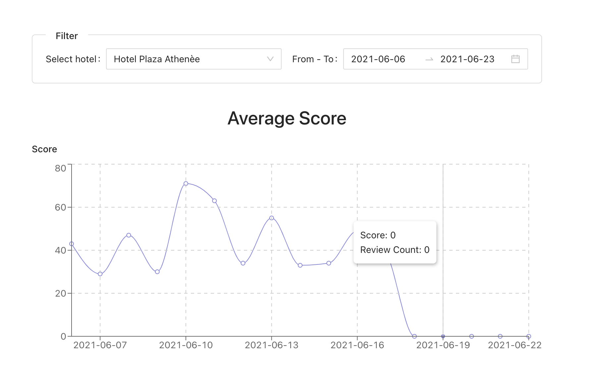

<div align="center">
  <h2>Hotel Review Analytics</h2>
  <a href="http://nestjs.com/" target="blank"></a>
</div>

## Install PostgreSQL and create `hotel` database

```bash
# Install PostgreSQL on your machine (which version you want but perfer latest version (v13 currently)
$ Create `hotel` database
```

## Running the backend service

```bash
# development
$ npm run start
```
## Running the frontend client

```bash
# development
$ cd dashboard/
$ npm run start
```
